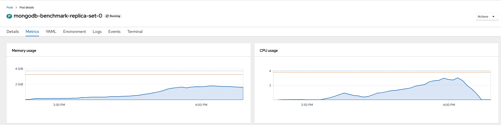
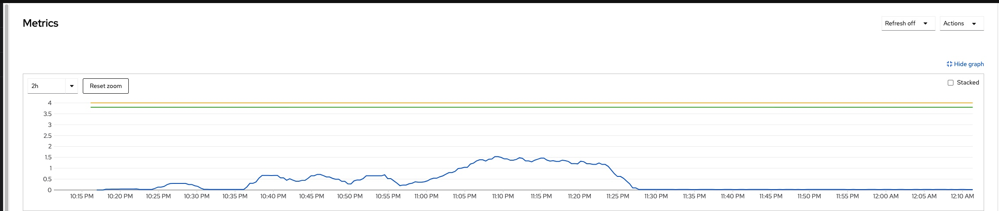
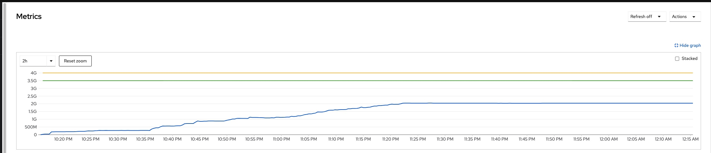
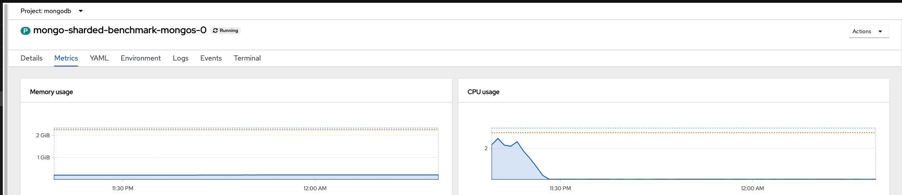

## Introduction

We ran the benchmark on an AWS Open Shift cluster. This page is capturing some key commands output during the time of execution.  

This page may not relevant to you if you are planning to set up anything.

# Environment Details
AWS OpenShift Cluster

Worker nodes - 4

16 vCPU and 32 GB of memory
## Replicaset

[Replicaset Full Spec](../replica-set.yaml)

**Pod Resources Spec**
```yaml
containers:
  - name: mongodb-enterprise-database
    resources:
      limits:
        cpu: "4"
        memory: 4000M
      requests:
        cpu: "3.8"
        memory: 3500M
```
```shell
> oc get pv
NAME                                       CAPACITY   ACCESS MODES   RECLAIM POLICY   STATUS   CLAIM                                                        STORAGECLASS   REASON   AGE
pvc-0b065c52-0b2e-4658-989c-e5ac94357694   10Gi       RWO            Delete           Bound    openshift-monitoring/alertmanager-data-alertmanager-main-2   gp2                     3h31m
pvc-10afdb43-5c5c-4db2-8596-74a68fa98219   15Gi       RWO            Delete           Bound    mongodb/data-mongodb-benchmark-replica-set-0                 gp2                     86m
pvc-2298e718-5295-4b92-a4d6-26d104be8144   15Gi       RWO            Delete           Bound    mongodb/data-ops-manager-db-1                                gp2                     121m
pvc-3e1b1173-8634-49ec-9a9c-1a5b253d3669   100Gi      RWO            Delete           Bound    openshift-monitoring/prometheus-data-prometheus-k8s-1        gp2                     3h31m
pvc-62975b74-8aa3-40af-8674-0b7510915440   15Gi       RWO            Delete           Bound    mongodb/data-mongodb-benchmark-replica-set-1                 gp2                     86m
pvc-9b7e4420-1a88-40b5-830a-1e648d5806cd   10Gi       RWO            Delete           Bound    openshift-monitoring/alertmanager-data-alertmanager-main-1   gp2                     3h31m
pvc-becf5b02-717d-4716-a9ab-23e4b927b86a   10Gi       RWO            Delete           Bound    openshift-monitoring/alertmanager-data-alertmanager-main-0   gp2                     3h31m
pvc-c307e010-3d1e-4ba0-be60-156fa6b0db6c   15Gi       RWO            Delete           Bound    mongodb/data-ops-manager-db-2                                gp2                     120m
pvc-df47bd67-2b0c-45b0-8222-7010092a7ed0   100Gi      RWO            Delete           Bound    openshift-monitoring/prometheus-data-prometheus-k8s-0        gp2                     3h31m
pvc-e00428ab-0d00-4204-bfc1-127e007c3c08   15Gi       RWO            Delete           Bound    mongodb/data-ops-manager-db-0                                gp2                     122m
pvc-f17a9b6f-b631-440f-b258-b978d17eba67   15Gi       RWO            Delete           Bound    mongodb/data-mongodb-benchmark-replica-set-2                 gp2                     85m
> oc get pvc
NAME                                   STATUS   VOLUME                                     CAPACITY   ACCESS MODES   STORAGECLASS   AGE
data-mongodb-benchmark-replica-set-0   Bound    pvc-10afdb43-5c5c-4db2-8596-74a68fa98219   15Gi       RWO            gp2            87m
data-mongodb-benchmark-replica-set-1   Bound    pvc-62975b74-8aa3-40af-8674-0b7510915440   15Gi       RWO            gp2            86m
data-mongodb-benchmark-replica-set-2   Bound    pvc-f17a9b6f-b631-440f-b258-b978d17eba67   15Gi       RWO            gp2            85m
data-ops-manager-db-0                  Bound    pvc-e00428ab-0d00-4204-bfc1-127e007c3c08   15Gi       RWO            gp2            122m
data-ops-manager-db-1                  Bound    pvc-2298e718-5295-4b92-a4d6-26d104be8144   15Gi       RWO            gp2            121m
data-ops-manager-db-2                  Bound    pvc-c307e010-3d1e-4ba0-be60-156fa6b0db6c   15Gi       RWO            gp2            120m
```



## Standalone

[Standalone Full Spec](../standalone.yaml)

**Pod Resource Spec**

```yaml
podTemplate:
      spec:        
        containers:
          - name: mongodb-enterprise-database
            resources:
              limits:
                cpu: "4"
                memory: 4000M
              requests:
                cpu: "3.8"
                memory: 3500M
```


```shell
 scripts git:(main) ✗ oc get pv
NAME                                       CAPACITY   ACCESS MODES   RECLAIM POLICY   STATUS   CLAIM                                                        STORAGECLASS   REASON   AGE
pvc-0b065c52-0b2e-4658-989c-e5ac94357694   10Gi       RWO            Delete           Bound    openshift-monitoring/alertmanager-data-alertmanager-main-2   gp2                     8h
pvc-10afdb43-5c5c-4db2-8596-74a68fa98219   15Gi       RWO            Delete           Bound    mongodb/data-mongodb-benchmark-replica-set-0                 gp2                     6h41m
pvc-2298e718-5295-4b92-a4d6-26d104be8144   15Gi       RWO            Delete           Bound    mongodb/data-ops-manager-db-1                                gp2                     7h16m
pvc-3b16c87a-b1c1-4132-acb6-e23b7a8cf55a   15Gi       RWO            Delete           Bound    mongodb/data-mongodb-benchmark-standalone-0                  gp2                     3h59m
pvc-3e1b1173-8634-49ec-9a9c-1a5b253d3669   100Gi      RWO            Delete           Bound    openshift-monitoring/prometheus-data-prometheus-k8s-1        gp2                     8h
pvc-62975b74-8aa3-40af-8674-0b7510915440   15Gi       RWO            Delete           Bound    mongodb/data-mongodb-benchmark-replica-set-1                 gp2                     6h41m
pvc-9b7e4420-1a88-40b5-830a-1e648d5806cd   10Gi       RWO            Delete           Bound    openshift-monitoring/alertmanager-data-alertmanager-main-1   gp2                     8h
pvc-becf5b02-717d-4716-a9ab-23e4b927b86a   10Gi       RWO            Delete           Bound    openshift-monitoring/alertmanager-data-alertmanager-main-0   gp2                     8h
pvc-c307e010-3d1e-4ba0-be60-156fa6b0db6c   15Gi       RWO            Delete           Bound    mongodb/data-ops-manager-db-2                                gp2                     7h14m
pvc-df47bd67-2b0c-45b0-8222-7010092a7ed0   100Gi      RWO            Delete           Bound    openshift-monitoring/prometheus-data-prometheus-k8s-0        gp2                     8h
pvc-e00428ab-0d00-4204-bfc1-127e007c3c08   15Gi       RWO            Delete           Bound    mongodb/data-ops-manager-db-0                                gp2                     7h17m
pvc-f17a9b6f-b631-440f-b258-b978d17eba67   15Gi       RWO            Delete           Bound    mongodb/data-mongodb-benchmark-replica-set-2                 gp2                     6h40m
➜  scripts git:(main) ✗ oc get pvc
NAME                                   STATUS   VOLUME                                     CAPACITY   ACCESS MODES   STORAGECLASS   AGE
data-mongodb-benchmark-replica-set-0   Bound    pvc-10afdb43-5c5c-4db2-8596-74a68fa98219   15Gi       RWO            gp2            6h41m
data-mongodb-benchmark-replica-set-1   Bound    pvc-62975b74-8aa3-40af-8674-0b7510915440   15Gi       RWO            gp2            6h41m
data-mongodb-benchmark-replica-set-2   Bound    pvc-f17a9b6f-b631-440f-b258-b978d17eba67   15Gi       RWO            gp2            6h40m
data-mongodb-benchmark-standalone-0    Bound    pvc-3b16c87a-b1c1-4132-acb6-e23b7a8cf55a   15Gi       RWO            gp2            3h59m
data-ops-manager-db-0                  Bound    pvc-e00428ab-0d00-4204-bfc1-127e007c3c08   15Gi       RWO            gp2            7h17m
data-ops-manager-db-1                  Bound    pvc-2298e718-5295-4b92-a4d6-26d104be8144   15Gi       RWO            gp2            7h16m
data-ops-manager-db-2                  Bound    pvc-c307e010-3d1e-4ba0-be60-156fa6b0db6c   15Gi       RWO            gp2            7h15m
```

## Sharded Cluster

[Sharded Cluster Full Spec](../sharded-cluster.yaml)

**Pod Resource Spec**

```yaml
shardPodSpec:
  podTemplate:
    spec:
      containers:
        - name: mongodb-enterprise-database
          resources:
            limits:
              cpu: "4"
              memory: 4000M
            requests:
              cpu: "3.8"
              memory: 3500M
```


```shell
 ➜  scripts git:(main) ✗ oc get pv
NAME                                       CAPACITY   ACCESS MODES   RECLAIM POLICY   STATUS   CLAIM                                                        STORAGECLASS   REASON   AGE
pvc-0b065c52-0b2e-4658-989c-e5ac94357694   10Gi       RWO            Delete           Bound    openshift-monitoring/alertmanager-data-alertmanager-main-2   gp2                     11h
pvc-0cf06a6e-50ed-4da8-8847-4f816b24047f   15Gi       RWO            Delete           Bound    mongodb/data-mongo-sharded-benchmark-0-0                     gp2                     131m
pvc-10afdb43-5c5c-4db2-8596-74a68fa98219   15Gi       RWO            Delete           Bound    mongodb/data-mongodb-benchmark-replica-set-0                 gp2                     9h
pvc-1efa127d-3431-45d7-aafb-dd4f1a0dde06   15Gi       RWO            Delete           Bound    mongodb/data-mongo-sharded-benchmark-3-1                     gp2                     128m
pvc-2298e718-5295-4b92-a4d6-26d104be8144   15Gi       RWO            Delete           Bound    mongodb/data-ops-manager-db-1                                gp2                     9h
pvc-3a7c517b-649d-456d-91cd-55e3a9e67c96   5Gi        RWO            Delete           Bound    mongodb/data-mongo-sharded-benchmark-config-0                gp2                     133m
pvc-3b16c87a-b1c1-4132-acb6-e23b7a8cf55a   15Gi       RWO            Delete           Bound    mongodb/data-mongodb-benchmark-standalone-0                  gp2                     6h20m
pvc-3e1b1173-8634-49ec-9a9c-1a5b253d3669   100Gi      RWO            Delete           Bound    openshift-monitoring/prometheus-data-prometheus-k8s-1        gp2                     11h
pvc-5e886012-efb4-445a-aba7-9d23f3b44bec   15Gi       RWO            Delete           Bound    mongodb/data-mongo-sharded-benchmark-2-0                     gp2                     129m
pvc-62975b74-8aa3-40af-8674-0b7510915440   15Gi       RWO            Delete           Bound    mongodb/data-mongodb-benchmark-replica-set-1                 gp2                     9h
pvc-7a94d321-7f5c-40e9-8783-3e14f14053ab   15Gi       RWO            Delete           Bound    mongodb/data-mongo-sharded-benchmark-0-1                     gp2                     131m
pvc-9b7e4420-1a88-40b5-830a-1e648d5806cd   10Gi       RWO            Delete           Bound    openshift-monitoring/alertmanager-data-alertmanager-main-1   gp2                     11h
pvc-bc3ffe82-f8e0-4fc0-b48f-05dc0f1f36d0   15Gi       RWO            Delete           Bound    mongodb/data-mongo-sharded-benchmark-1-1                     gp2                     130m
pvc-becf5b02-717d-4716-a9ab-23e4b927b86a   10Gi       RWO            Delete           Bound    openshift-monitoring/alertmanager-data-alertmanager-main-0   gp2                     11h
pvc-c307e010-3d1e-4ba0-be60-156fa6b0db6c   15Gi       RWO            Delete           Bound    mongodb/data-ops-manager-db-2                                gp2                     9h
pvc-c61e8188-e7a9-4c0e-89e2-e370d2f8fe3e   15Gi       RWO            Delete           Bound    mongodb/data-mongo-sharded-benchmark-1-0                     gp2                     130m
pvc-d9ba6ecb-f2b8-4327-abb8-15ec0d4a74ff   5Gi        RWO            Delete           Bound    mongodb/data-mongo-sharded-benchmark-config-1                gp2                     132m
pvc-db8669bc-3a61-4d9e-ba62-93c738efc68b   15Gi       RWO            Delete           Bound    mongodb/data-mongo-sharded-benchmark-3-0                     gp2                     128m
pvc-df47bd67-2b0c-45b0-8222-7010092a7ed0   100Gi      RWO            Delete           Bound    openshift-monitoring/prometheus-data-prometheus-k8s-0        gp2                     11h
pvc-e00428ab-0d00-4204-bfc1-127e007c3c08   15Gi       RWO            Delete           Bound    mongodb/data-ops-manager-db-0                                gp2                     9h
pvc-eb2f7d60-61b0-4f11-8a6a-98fc1a1c08c1   15Gi       RWO            Delete           Bound    mongodb/data-mongo-sharded-benchmark-2-1                     gp2                     129m
pvc-f17a9b6f-b631-440f-b258-b978d17eba67   15Gi       RWO            Delete           Bound    mongodb/data-mongodb-benchmark-replica-set-2                 gp2                     9h
➜  scripts git:(main) ✗ oc get pvc
NAME                                    STATUS   VOLUME                                     CAPACITY   ACCESS MODES   STORAGECLASS   AGE
data-mongo-sharded-benchmark-0-0        Bound    pvc-0cf06a6e-50ed-4da8-8847-4f816b24047f   15Gi       RWO            gp2            131m
data-mongo-sharded-benchmark-0-1        Bound    pvc-7a94d321-7f5c-40e9-8783-3e14f14053ab   15Gi       RWO            gp2            131m
data-mongo-sharded-benchmark-1-0        Bound    pvc-c61e8188-e7a9-4c0e-89e2-e370d2f8fe3e   15Gi       RWO            gp2            131m
data-mongo-sharded-benchmark-1-1        Bound    pvc-bc3ffe82-f8e0-4fc0-b48f-05dc0f1f36d0   15Gi       RWO            gp2            130m
data-mongo-sharded-benchmark-2-0        Bound    pvc-5e886012-efb4-445a-aba7-9d23f3b44bec   15Gi       RWO            gp2            129m
data-mongo-sharded-benchmark-2-1        Bound    pvc-eb2f7d60-61b0-4f11-8a6a-98fc1a1c08c1   15Gi       RWO            gp2            129m
data-mongo-sharded-benchmark-3-0        Bound    pvc-db8669bc-3a61-4d9e-ba62-93c738efc68b   15Gi       RWO            gp2            129m
data-mongo-sharded-benchmark-3-1        Bound    pvc-1efa127d-3431-45d7-aafb-dd4f1a0dde06   15Gi       RWO            gp2            128m
data-mongo-sharded-benchmark-config-0   Bound    pvc-3a7c517b-649d-456d-91cd-55e3a9e67c96   5Gi        RWO            gp2            133m
data-mongo-sharded-benchmark-config-1   Bound    pvc-d9ba6ecb-f2b8-4327-abb8-15ec0d4a74ff   5Gi        RWO            gp2            132m
data-mongodb-benchmark-replica-set-0    Bound    pvc-10afdb43-5c5c-4db2-8596-74a68fa98219   15Gi       RWO            gp2            9h
data-mongodb-benchmark-replica-set-1    Bound    pvc-62975b74-8aa3-40af-8674-0b7510915440   15Gi       RWO            gp2            9h
data-mongodb-benchmark-replica-set-2    Bound    pvc-f17a9b6f-b631-440f-b258-b978d17eba67   15Gi       RWO            gp2            9h
data-mongodb-benchmark-standalone-0     Bound    pvc-3b16c87a-b1c1-4132-acb6-e23b7a8cf55a   15Gi       RWO            gp2            6h20m
data-ops-manager-db-0                   Bound    pvc-e00428ab-0d00-4204-bfc1-127e007c3c08   15Gi       RWO            gp2            9h
data-ops-manager-db-1                   Bound    pvc-2298e718-5295-4b92-a4d6-26d104be8144   15Gi       RWO            gp2            9h
data-ops-manager-db-2                   Bound    pvc-c307e010-3d1e-4ba0-be60-156fa6b0db6c   15Gi       RWO            gp2            9h
```




